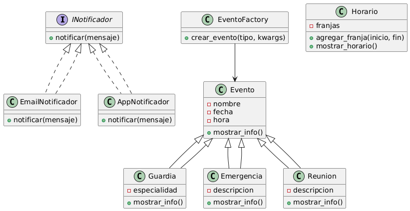

# Planificador Médico v3.0 - Tercer Corte 🏥

## Sistema de Gestión Médica con Clean Architecture

### 📋 Descripción del Proyecto

Sistema integral para la gestión de eventos médicos, guardias, emergencias y personal hospitalario. Implementa **Clean Architecture**, principios **SOLID** y patrones de diseño modernos para garantizar escalabilidad, mantenibilidad y robusteza en entornos críticos de salud.

En el ámbito médico y de emergencias, la gestión eficiente de turnos, guardias, reuniones clínicas y alertas es fundamental para salvar vidas y optimizar recursos. Los profesionales enfrentan estrés y riesgos por mala organización, falta de comunicación y sobrecarga de tareas. Este sistema centraliza la gestión de horarios, tareas críticas y notificaciones en una herramienta web automatizada, confiable y rápida.

**📚 Documentación del Proyecto:**
- [📖 Arquitectura Completa](docs/Arquitectura_Completa.md) - Modelos 4+1 y C4
- [🎨 Presentación Creativa](docs/Presentacion_Creativa.md) - Historia del usuario
- [⚙️ Análisis Técnico](docs/Analisis_Tecnico.md) - Principios SOLID y patrones
- [👥 Créditos y Roles](docs/Creditos_Roles.md) - Equipo de desarrollo
- [🖼️ Presentación en Canva](https://www.canva.com/design/DAGwdS9Fnm8/BmZbxAsDl4N1BSSDWAEj0g/edit)

### 🚀 Nuevas Características - Tercer Corte

- **🏗️ Clean Architecture**: Implementación completa con 4 capas bien definidas
- **🔒 Seguridad Robusta**: JWT + BCrypt + autorización por roles
- **🐳 Contenedorización**: Docker completo para desarrollo y producción  
- **💉 Dependency Injection**: Container DI centralizado
- **🧪 Testing**: Arquitectura preparada para testing completo
- **📊 Monitoreo**: Prometheus + Grafana integrados
- **🔧 DevOps**: CI/CD preparado con GitHub Actions

### 🎯 Atributos de Calidad Logrados

- **✅ Confiabilidad**: Arquitectura robusta con manejo de errores
- **✅ Disponibilidad**: Contenedores con health checks y reinicio automático
- **✅ Usabilidad**: API REST intuitiva y documentada
- **✅ Mantenibilidad**: Clean Architecture con separación de responsabilidades
- **✅ Reusabilidad**: Componentes modulares y reutilizables
- **✅ Escalabilidad**: Preparado para microservicios y alta concurrencia
- **✅ Seguridad**: Implementación completa de autenticación y autorización
- **✅ Testabilidad**: Dependencias inyectadas y arquitectura limpia

# 3. Diseño de software

## Principios SOLID aplicados y justificados

- **SRP:** La clase `Horario` gestiona únicamente los turnos y guardias médicas.
- **OCP:** Añadir nuevos tipos de alertas no requiere modificar el código base gracias a la interfaz `INotificador`.
- **DIP:** Las clases de alto nivel dependen de la abstracción `INotificador`.

## Patrones de diseño utilizados y justificación

- **Factory Method:** Para crear eventos médicos.
- **Observer:** Para notificaciones automáticas.

## UML



# 4. Implementación

## Estructura del código y enlaces explicativos

- `/src/modelo`: Clases principales
- `/src/notificaciones`: Interfaces y clases de notificación
- `/src/factoria`: Factory Method
- `/web`: Interfaz visual
- `/backend`: Lógica y API Flask

## Ejemplo de uso (backend)

```python
from src.factoria.EventoFactory import EventoFactory
guardia = EventoFactory.crear_evento("guardia", nombre="Guardia Nocturna", fecha="2025-08-20", hora="22:00", especialidad="Urgencias")
print(guardia.mostrar_info())
emergencia = EventoFactory.crear_evento("emergencia", nombre="Emergencia Cardiaca", fecha="2025-08-20", hora="03:00", descripcion="Paciente con paro cardíaco")
print(emergencia.mostrar_info())
```

## Ejemplo de uso (frontend)

```js
fetch("http://localhost:5000/api/evento", {
  method: "POST",
  headers: { "Content-Type": "application/json" },
  body: JSON.stringify({
    tipo: "guardia",
    nombre: "Guardia Nocturna",
    fecha: "2025-08-20",
    hora: "22:00",
    especialidad: "Urgencias",
  }),
});
```

# 5. Análisis técnico

- [Análisis técnico detallado](docs/Analisis_Tecnico.md)

# 6. Créditos y roles del equipo

- Jacobo Andrés Pacheco Martínez (ID 0000260017): Arquitecto de Software y Líder Técnico
- Juan Camilo Hernández Díaz (ID 0000308561): Desarrollador Backend y Especialista en Integración
- Juan Felipe Jaime (ID 0000243671): Desarrollador Frontend y Experiencia de Usuario
