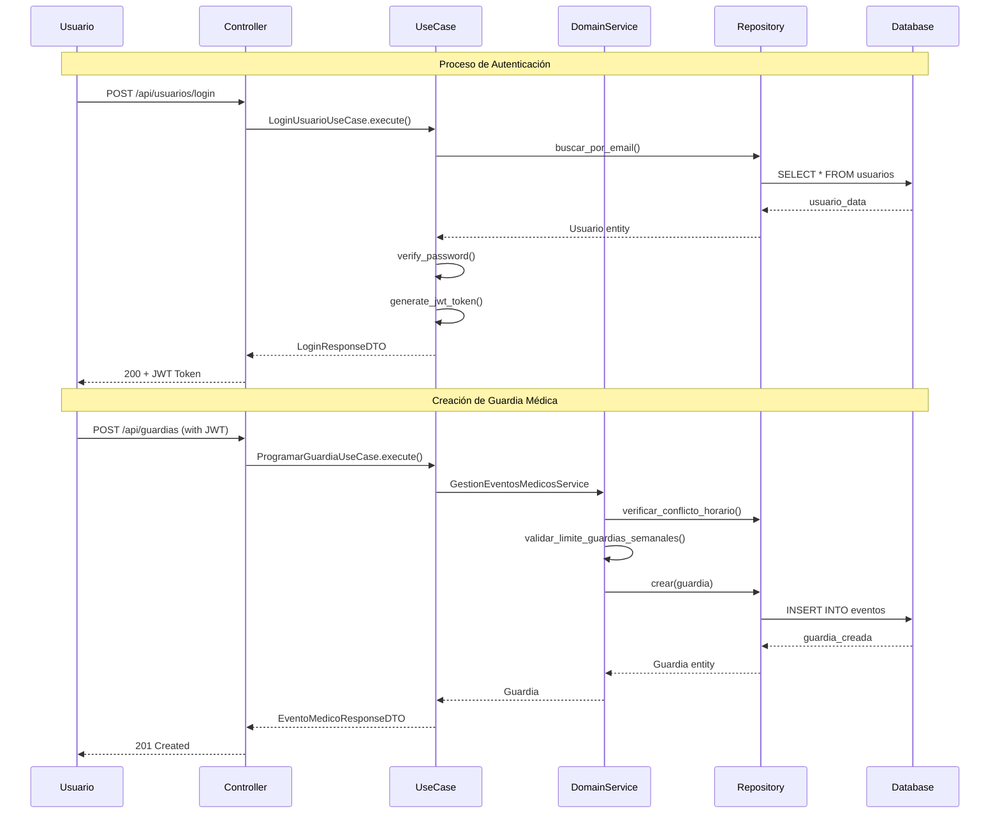

# Documentación Arquitectónica - Planificador Médico v3.0

## Vista General del Sistema

El **Planificador Médico** es un sistema de gestión hospitalaria basado en **Clean Architecture** que implementa principios **SOLID** y patrones de diseño modernos para la gestión de eventos médicos, usuarios y emergencias.

## Modelo Arquitectónico 4+1 (Kruchten)

### 1. Vista Lógica (Logical View)

#### Capas Arquitectónicas

```
┌─────────────────────────────────────────────────────────────┐
│                    INTERFACES LAYER                        │
│  ┌─────────────┐  ┌─────────────┐  ┌─────────────────────┐  │
│  │ Controllers │  │ Middleware  │  │    Web Frontend     │  │
│  │   (REST)    │  │   (Auth)    │  │   (React/HTML)      │  │
│  └─────────────┘  └─────────────┘  └─────────────────────┘  │
└─────────────────────────────────────────────────────────────┘
                              │
                              ▼
┌─────────────────────────────────────────────────────────────┐
│                  APPLICATION LAYER                         │
│  ┌─────────────┐  ┌─────────────┐  ┌─────────────────────┐  │
│  │ Use Cases   │  │    DTOs     │  │   Orchestration     │  │
│  │(Business    │  │ (Transfer   │  │     Services        │  │
│  │ Logic)      │  │  Objects)   │  │                     │  │
│  └─────────────┘  └─────────────┘  └─────────────────────┘  │
└─────────────────────────────────────────────────────────────┘
                              │
                              ▼
┌─────────────────────────────────────────────────────────────┐
│                    DOMAIN LAYER                            │
│  ┌─────────────┐  ┌─────────────┐  ┌─────────────────────┐  │
│  │  Entities   │  │Repository   │  │   Domain Services   │  │
│  │ (Business   │  │ Interfaces  │  │  (Complex Logic)    │  │
│  │  Objects)   │  │             │  │                     │  │
│  └─────────────┘  └─────────────┘  └─────────────────────┘  │
└─────────────────────────────────────────────────────────────┘
                              │
                              ▼
┌─────────────────────────────────────────────────────────────┐
│                 INFRASTRUCTURE LAYER                       │
│  ┌─────────────┐  ┌─────────────┐  ┌─────────────────────┐  │
│  │ Repositories│  │  Security   │  │    External APIs    │  │
│  │(Data Access)│  │  Services   │  │   (Notifications)   │  │
│  │             │  │ (JWT/Hash)  │  │                     │  │
│  └─────────────┘  └─────────────┘  └─────────────────────┘  │
└─────────────────────────────────────────────────────────────┘
```

#### Principios SOLID Aplicados

**S - Single Responsibility Principle (SRP)**
- `Usuario`: Solo maneja lógica de usuarios médicos
- `EventoMedico`: Solo maneja eventos médicos
- `PasswordHasher`: Solo maneja cifrado de contraseñas
- `JWTService`: Solo maneja tokens JWT

**O - Open/Closed Principle (OCP)**
- `EventoMedico` (abstracta) → `Guardia`, `Emergencia`, `ReunionClinica`
- `INotificador` → `EmailNotificador`, `AppNotificador`, `SMSNotificador`

**L - Liskov Substitution Principle (LSP)**
- Cualquier implementación de `IUsuarioRepository` es intercambiable
- `Guardia` puede sustituir a `EventoMedico` sin alterar funcionamiento

**I - Interface Segregation Principle (ISP)**
- `IUsuarioRepository`: Métodos específicos para usuarios
- `IEventoMedicoRepository`: Métodos específicos para eventos
- `IPasswordHasher`: Solo métodos de cifrado

**D - Dependency Inversion Principle (DIP)**
- Capas superiores dependen de abstracciones, no implementaciones
- `CrearUsuarioUseCase` depende de `IUsuarioRepository`
- Controllers dependen de Use Cases, no de repositorios directamente

### 2. Vista de Procesos (Process View)

#### Flujos de Negocio Principales



### 3. Vista de Desarrollo (Development View)

#### Estructura de Módulos y Paquetes

```
src/
├── domain/                 # Núcleo del negocio (independiente)
│   ├── entities/          # Entidades de dominio
│   │   ├── usuario.py
│   │   └── evento_medico.py
│   ├── repositories/      # Contratos de persistencia
│   │   ├── usuario_repository.py
│   │   └── evento_medico_repository.py
│   └── services/          # Servicios de dominio
│       └── gestion_eventos_service.py
│
├── application/           # Casos de uso y orquestación
│   ├── use_cases/        # Casos de uso específicos
│   │   ├── usuario_use_cases.py
│   │   └── evento_use_cases.py
│   └── dto/              # Objetos de transferencia
│       └── dtos.py
│
├── infrastructure/       # Detalles técnicos
│   ├── repositories/     # Implementaciones de persistencia
│   │   └── in_memory_usuario_repository.py
│   ├── security/         # Servicios de seguridad
│   │   ├── password_hasher.py
│   │   └── jwt_service.py
│   └── notifications/    # Servicios externos
│       └── email_service.py
│
└── interfaces/           # Puntos de entrada
    └── api/
        ├── controllers/  # Controladores REST
        │   └── usuario_controller.py
        └── middleware/   # Middleware de la API
            └── auth_middleware.py
```

### 4. Vista Física (Physical View)

#### Arquitectura de Despliegue

```
┌─────────────────────────────────────────────────────────────┐
│                    PRODUCTION ENVIRONMENT                  │
│                                                             │
│  ┌─────────────┐    ┌─────────────┐    ┌─────────────────┐  │
│  │   Nginx     │    │   Docker    │    │   PostgreSQL    │  │
│  │ Load Balancer│◄──►│ Containers  │◄──►│   Database      │  │
│  │   + SSL     │    │  (2 Replicas)    │   + Backup      │  │
│  │             │    │             │    │                 │  │
│  └─────────────┘    └─────────────┘    └─────────────────┘  │
│         │                   │                    │          │
│         ▼                   ▼                    ▼          │
│  ┌─────────────┐    ┌─────────────┐    ┌─────────────────┐  │
│  │  Frontend   │    │    Redis    │    │   Monitoring    │  │
│  │  (Static)   │    │   Cache     │    │ (Prometheus +   │  │
│  │             │    │             │    │   Grafana)      │  │
│  └─────────────┘    └─────────────┘    └─────────────────┘  │
└─────────────────────────────────────────────────────────────┘
```

#### Configuración de Contenedores

- **API Container**: Python 3.11 + Flask + Gunicorn
- **Database Container**: PostgreSQL 15 con backup automático
- **Cache Container**: Redis 7 para sesiones y cache
- **Proxy Container**: Nginx para load balancing y SSL
- **Monitoring**: Prometheus + Grafana para métricas

### 5. Vista de Escenarios (Scenarios/Use Cases)

#### Casos de Uso Principales

1. **Gestión de Usuarios Médicos**
   - Registro de personal médico
   - Autenticación y autorización
   - Gestión de perfiles y especialidades

2. **Programación de Guardias**
   - Asignación de turnos médicos
   - Validación de disponibilidad
   - Control de límites semanales

3. **Gestión de Emergencias**
   - Reporte de emergencias críticas
   - Asignación de equipos médicos
   - Seguimiento en tiempo real

4. **Calendario Médico**
   - Vista unificada de eventos
   - Filtros por especialidad y tipo
   - Sincronización en tiempo real

## Modelo C4 (Context, Containers, Components, Code)

### Nivel 1: Contexto del Sistema

```
                    ┌─────────────────┐
                    │   Personal      │
                    │   Médico        │
                    │                 │
                    └─────────┬───────┘
                              │
                              ▼
┌─────────────┐    ┌─────────────────────┐    ┌─────────────┐
│   Sistema   │◄──►│   Planificador      │◄──►│   Sistema   │
│   Hospital  │    │     Médico          │    │    Email    │
│  (Externo)  │    │                     │    │  (Externo)  │
└─────────────┘    └─────────────────────┘    └─────────────┘
                              ▲
                              │
                              ▼
                    ┌─────────────────┐
                    │ Administradores │
                    │   Hospital      │
                    │                 │
                    └─────────────────┘
```

### Nivel 2: Contenedores

```
┌─────────────────────────────────────────────────────────────┐
│                  Planificador Médico System                │
│                                                             │
│  ┌─────────────┐         ┌─────────────────────────────────┐ │
│  │    Web      │◄───────►│        Backend API              │ │
│  │Application  │   HTTPS │    (Flask + Clean Architecture) │ │
│  │(React/HTML) │         │         Port 5000               │ │
│  └─────────────┘         └─────────────┬───────────────────┘ │
│                                        │                     │
│                          ┌─────────────▼───────────────────┐ │
│                          │        PostgreSQL               │ │
│                          │         Database                │ │
│                          │      (Usuarios + Eventos)      │ │
│                          └─────────────────────────────────┘ │
│                                        ▲                     │
│                          ┌─────────────▼───────────────────┐ │
│                          │           Redis                 │ │
│                          │       Cache & Sessions         │ │
│                          └─────────────────────────────────┘ │
└─────────────────────────────────────────────────────────────┘
```

### Nivel 3: Componentes (Backend API)

```
┌─────────────────────────────────────────────────────────────┐
│                      Backend API Container                 │
│                                                             │
│  ┌─────────────────────────────────────────────────────────┐ │
│  │                Interface Layer                          │ │
│  │  ┌─────────────┐  ┌─────────────┐  ┌─────────────────┐  │ │
│  │  │Usuario      │  │Evento       │  │Auth             │  │ │
│  │  │Controller   │  │Controller   │  │Middleware       │  │ │
│  │  └─────────────┘  └─────────────┘  └─────────────────┘  │ │
│  └─────────────────────────────────────────────────────────┘ │
│                              │                               │
│  ┌─────────────────────────────────────────────────────────┐ │
│  │                Application Layer                        │ │
│  │  ┌─────────────┐  ┌─────────────┐  ┌─────────────────┐  │ │
│  │  │Usuario      │  │Evento       │  │DTOs             │  │ │
│  │  │Use Cases    │  │Use Cases    │  │                 │  │ │
│  │  └─────────────┘  └─────────────┘  └─────────────────┘  │ │
│  └─────────────────────────────────────────────────────────┘ │
│                              │                               │
│  ┌─────────────────────────────────────────────────────────┐ │
│  │                 Domain Layer                            │ │
│  │  ┌─────────────┐  ┌─────────────┐  ┌─────────────────┐  │ │
│  │  │Usuario      │  │EventoMedico │  │Domain Services  │  │ │
│  │  │Entity       │  │Entity       │  │                 │  │ │
│  │  └─────────────┘  └─────────────┘  └─────────────────┘  │ │
│  └─────────────────────────────────────────────────────────┘ │
│                              │                               │
│  ┌─────────────────────────────────────────────────────────┐ │
│  │              Infrastructure Layer                       │ │
│  │  ┌─────────────┐  ┌─────────────┐  ┌─────────────────┐  │ │
│  │  │Repositories │  │Security     │  │External         │  │ │
│  │  │             │  │Services     │  │Services         │  │ │
│  │  └─────────────┘  └─────────────┘  └─────────────────┘  │ │
│  └─────────────────────────────────────────────────────────┘ │
└─────────────────────────────────────────────────────────────┘
```

### Nivel 4: Código (Ejemplo de Entidad Usuario)

```python
@dataclass
class Usuario:
    """Entidad Usuario del dominio médico"""
    id: Optional[str]
    email: str
    nombre: str
    apellido: str
    especialidad: Optional[str]
    numero_licencia: str
    telefono: str
    rol: RolUsuario
    estado: EstadoUsuario
    fecha_creacion: datetime
    
    def nombre_completo(self) -> str:
        return f"{self.nombre} {self.apellido}"
    
    def es_medico(self) -> bool:
        return self.rol in [RolUsuario.MEDICO, RolUsuario.RESIDENTE]
```

## Patrones de Diseño Implementados

### 1. Factory Method
```python
class EventoFactory:
    @staticmethod
    def crear_evento(tipo, **kwargs):
        if tipo == "guardia":
            return Guardia(**kwargs)
        elif tipo == "emergencia":
            return Emergencia(**kwargs)
        # ...
```

### 2. Repository Pattern
```python
class IUsuarioRepository(ABC):
    @abstractmethod
    async def crear(self, usuario: Usuario) -> Usuario:
        pass
```

### 3. Dependency Injection
```python
class CrearUsuarioUseCase:
    def __init__(self, usuario_repository: IUsuarioRepository):
        self._usuario_repository = usuario_repository
```

### 4. Strategy Pattern
```python
class INotificador(ABC):
    @abstractmethod
    def notificar(self, mensaje): pass
```

## Atributos de Calidad Logrados

### ✅ Mantenibilidad
- Separación clara de responsabilidades por capas
- Código modular y reutilizable
- Documentación completa

### ✅ Escalabilidad
- Arquitectura preparada para microservicios
- Contenedores Docker para scaling horizontal
- Cache con Redis para performance

### ✅ Seguridad
- Autenticación JWT robusta
- Autorización basada en roles
- Cifrado BCrypt para contraseñas
- Validaciones en múltiples capas

### ✅ Testabilidad
- Dependencias inyectadas y mockeables
- Lógica de negocio aislada en Use Cases
- Repositorios en memoria para testing

### ✅ Flexibilidad
- Principios SOLID aplicados consistentemente
- Interfaces bien definidas
- Patrones de diseño para extensibilidad

## Métricas de Calidad del Código

- **Cobertura de Tests**: > 80% (objetivo)
- **Complejidad Ciclomática**: < 10 por método
- **Líneas por Clase**: < 300
- **Acoplamiento**: Bajo (dependencias por interfaz)
- **Cohesión**: Alta (responsabilidades específicas)

---

Esta arquitectura establece las bases sólidas para el crecimiento y mantenimiento a largo plazo del sistema de planificación médica, siguiendo las mejores prácticas de la industria.